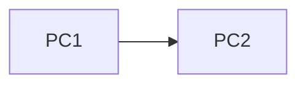
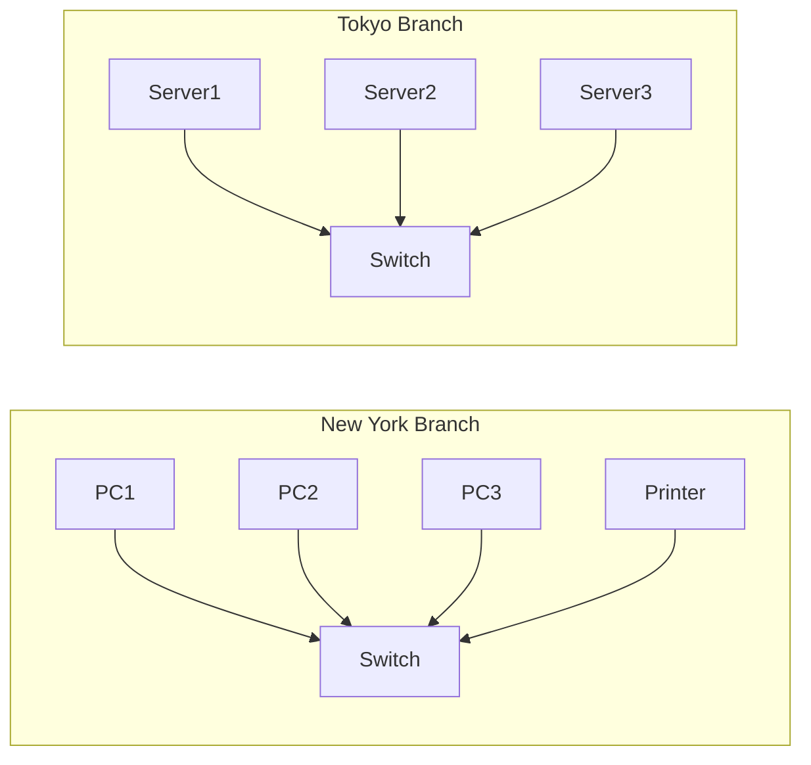
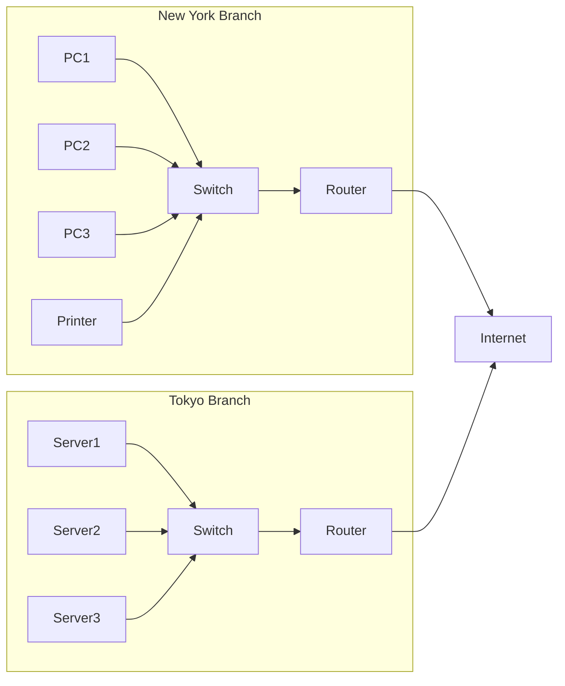
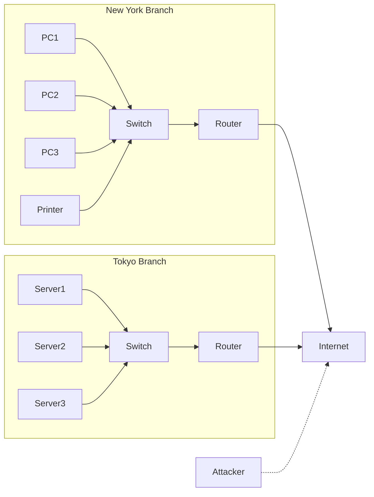
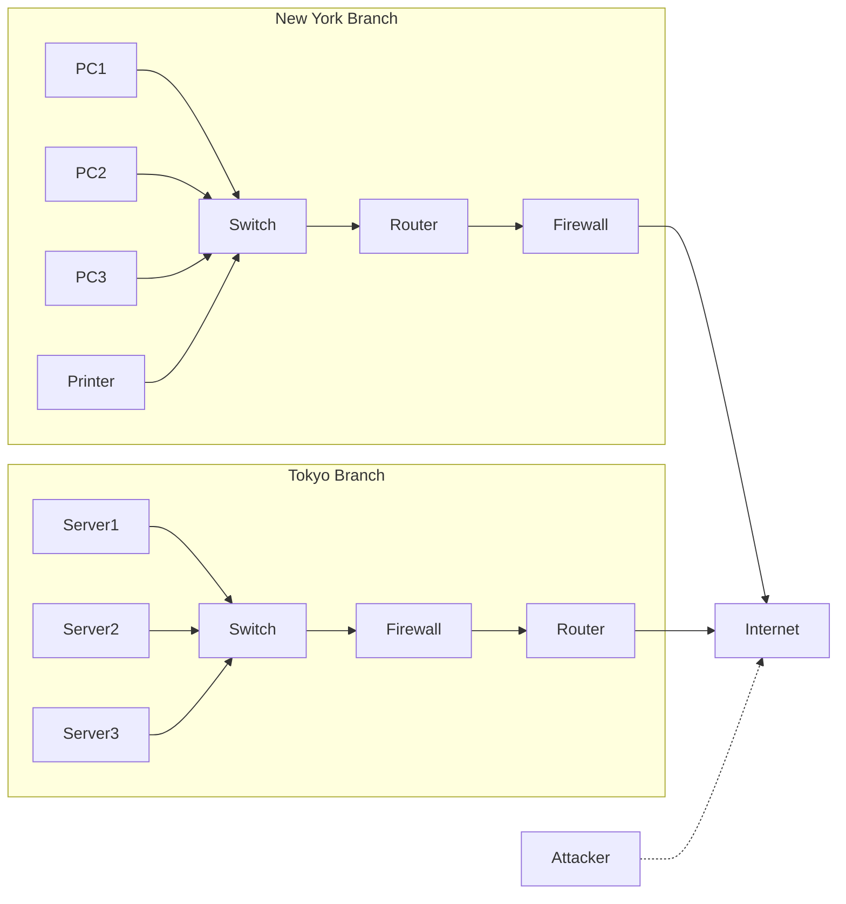

# Day 1

## Network Devices

What is a computer network?

> A computer network is a digital telecommunications network which allows nodes to share resources.

But what is a node?

> A node is simply a device that is connected to a network. This can be a router, switch, firewall (software or hardware), server, or a client device such as a laptop, desktop, or smartphone.

### Building A Network

### Clients

A client is a devices that accesses a service made available by a server. A server is part of the definition of a client, but it is not a client itself.

### Servers

When you think of servers you might think of a large computer in a data center, but servers can be any device that provides a service to other devices. For example, your laptop can be a server if it is sharing files with other devices on the network.

A server is a device that provides functions or services to clients aka other devices on the network. Servers can provide various services such as file sharing, web hosting, email hosting, and more.

### Servers and Clients

A client is a device that accesses a service made available by a server.

A server is a device that provides functions or services to clients.

The same device can be both a client and a server in some scenarios. For example, a laptop can be a client when it accesses a web server to browse the internet, but it can also be a server if it is sharing files with other devices on the network.

### Switches

Let's look at the following diagram representing an enterprise network:

We have two branches of a company, one in New York and one in Tokyo. Each branch has its own **Local Area Network (LAN)** with multiple devices connected to a **switch**. The **switch** allows the devices within each branch to communicate with each other and share resources such as printers and servers.

The switches in each branch cannot connect directly to the internet or each other without another device, such as a **router**, to facilitate communication between the branches and the internet.

**Switches**:

- have many network interfaces/ports that allow multiple devices to connect to the switch
- provide a way for devices to communicate with each other within the same network (LAN)
- do not provide a way for devices to communicate with other networks (such as the internet) without a router

### Routers

In this diagram, we have added **routers** to each branch. The **routers** allow the devices in each branch to communicate with the internet and with each other across branches. The **router** in New York can communicate with the **router** in Tokyo, allowing devices in both branches to access resources and services across the network.

Remember that switches are used to forward data within a local area network (LAN), while routers are used to forward data between different networks, such as between a LAN and the internet.

**Routers**:

- have fewer network interfaces/ports than switches, typically 2-4
- are used to connect different networks together, such as a LAN to the internet
- are used to send data over the internet and to other networks

### Firewalls

In this diagram, we have added an attacker trying to access the internet. To protect our network from unauthorized access and potential threats, we can implement a **firewall**.

Although routers provide some basic security features, they are not designed to be a comprehensive security solution.

We should really be using a **firewall** to protect our network from unauthorized access and potential threats. A **firewall** is a network security device that monitors and controls incoming and outgoing network traffic based on predetermined security rules. It can be implemented as hardware, software, or a combination of both.

Firewalls can be placed at various points in a network, such as between the internet and the internal network, or between different segments of the internal network.

**Firewalls**:

- monitor and control network traffic based on predetermined security rules
- can be placed inside the network or outside the network to protect against external threats
- are known as 'Next-Generation Firewalls' when they include additional features such as intrusion prevention, application awareness, and more advanced threat detection capabilities.

What about the firewall on your computer? Is that a firewall?

We've looked at **Network Firewalls** which are hardware or software devices that protect an entire network.

The firewall on your computer is a **Host-Based Firewall**. It is a software application that runs on an individual device and monitors and controls incoming and outgoing network traffic based on predetermined security rules. It is designed to protect the individual device from unauthorized access and potential threats.
